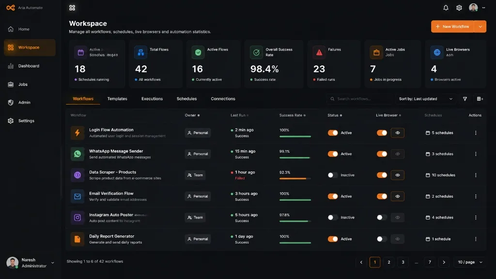
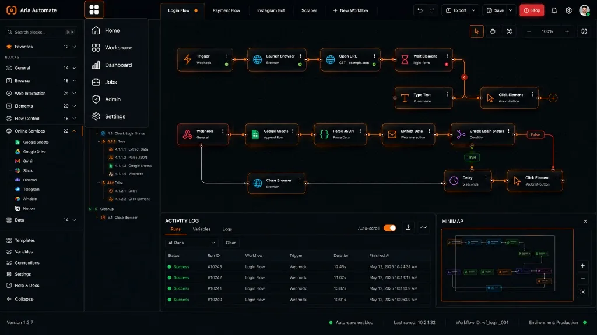

# HANDOFF — Locked 6-Area UI Architecture (Workspace hub)

> **Read this first if you are a fresh session with no chat history.**
> It states exactly what was delivered, what is still open, and how to finish it
> without re-deriving any decision.

| | |
|---|---|
| **Branch** | `genspark_ai_developer` (base `main` @ `f373580`) |
| **Written** | 2026-07-28 |
| **Source of truth** | `docs/uiux/01-REPORT-ui-architecture-update.md` (user's report, verbatim) + the two locked images below |
| **Status** | Implementation **complete and green**. Integration tests + a few polish items **deferred** (§ 4). |
| **Green as of this doc** | `npm run check` → clean · `npx vitest run tests/unit` → **28 files / 543 tests passed** |

---

## 1. The locked design images

Both images the user supplied are committed in the repo-standard triple form
(`<stem>.webp` full + `lite/<stem>.jpg` ~910 px analysis copy + `<stem>.md` spec).

### 1.1 `docs/uiux/workspace-overview.webp` — the Workspace hub



The primary screen this whole change exists to build. What it locks:

* **Sidebar with exactly 6 items** — `Home, Workspace, Dashboard, Jobs, Admin, Settings`.
  Nothing else. `Live View`, `Live Browser`, `Schedules`, `Active Flow` are **gone**
  from navigation and became *per-workflow capabilities* reachable from a row.
* **Header** — brand on one side, a single **App Launcher** icon (4 squares,
  Windows-11 style) on the other. No other header navigation.
* **7 stat cards** in this exact left-to-right order:
  `Active Schedules · Total Flows · Active Flows · Success Rate · Failures · Active Jobs · Live Browsers`
* **Workflow table** with 8 columns:
  `Workflow · Owner · Last Run · Success Rate · Status · Live Browser · Schedules · Actions`
* Per-row **Active toggle**, per-row **Live Browser toggle + eye button**, per-row **⋮ menu**.
* Tab strip (`Workflows · Templates · Executions · Schedules · Connections`),
  search pill, sort select, filter + density icon buttons, footer pager.
* Dark canvas, orange accent, rounded cards, low-chrome enterprise feel.

Full pixel spec incl. the truth table and A/B/C parameter mapping:
**[`workspace-overview.md`](./workspace-overview.md)**

### 1.2 `docs/uiux/shell-editor-launcher-menu.webp` — editor shell + open launcher



Locks the **App Launcher in its open state** and proves the shell stays identical
inside the flow editor. What it locks:

* Launcher button 34×34, radius 9; when open it takes the orange accent plus a
  `0 0 0 3px rgba(255,138,31,0.18)` focus ring.
* Floating panel: 196 px wide, `#111318`, radius 12, shadow `0 18px 44px rgba(0,0,0,0.55)`,
  36 px rows, icon + label, the **same six areas in the same order** as the sidebar,
  current area highlighted orange.
* The editor keeps the identical header/sidebar chrome — the launcher is shell-level,
  not page-level.

Full spec: **[`shell-editor-launcher-menu.md`](./shell-editor-launcher-menu.md)**

### 1.3 One deliberate conflict, resolved

The report lists the stat cards with **Total Flows first**; the locked image puts
**Active Schedules first**. **The image wins** — it is the newer, more specific
artefact. This is documented in `workspace-overview.md` § 3D, encoded in
`WS_CARDS` in `public/js/views.js`, and *pinned by a test* so nobody "fixes" it
back to the report order.

---

## 2. The three-state Live Browser rule (the subtlest requirement)

`Active` and `Live Browser` are two independent per-workflow switches, and their
combination decides whether the eye button can be clicked:

| Active | Live Browser | Toggle look | Eye button | Meaning |
|---|---|---|---|---|
| ON | ON | orange / on | **enabled** (`eye`) | watchable now |
| **OFF** | ON | **gray `.muted-on`** | disabled (`eye-off`) | intent kept, but the flow never runs → nothing to watch |
| ON | OFF | off | disabled (`eye-off`) | runs headless by choice |

Implemented as one expression in `views.js`, which the test pins verbatim:

```js
var active = wf.active !== false;      // legacy records default to active
var on     = wf.liveBrowser === true;  // legacy records default to off
var watchable = active && on;
```

The two disabled cases must show **different tooltips**
(`ws.watchDisabledInactive` vs `ws.watchDisabledOff`) — a test asserts they differ.

**Playwright relation:** `liveBrowser` is what selects visible vs headless
browser. **Enforcement is server-side**, not UI-side: running an inactive
workflow returns `409 { error: 'Workflow is inactive' }`
(`src/Routes/user.routes.ts:876`). The disabled eye is convenience only.

---

## 3. What is done (all committed, all green)

Three commits on `genspark_ai_developer`:

```
7f36d24 test(ui): guard locked 6-area architecture + workflow state flags
05fa608 feat(ui): Workspace hub, App Launcher, Home & Settings views + locked CSS/i18n
3441c3e feat(ui): locked 6-area architecture — docs, icons, backend state flags, shell nav
```

### 3.1 Docs
* `docs/uiux/workspace-overview.{webp,md}` + `lite/workspace-overview.jpg`
* `docs/uiux/shell-editor-launcher-menu.{webp,md}` + `lite/shell-editor-launcher-menu.jpg`
* `docs/uiux/01-REPORT-ui-architecture-update.md` — the user's report verbatim + provenance
* `docs/uiux/README.md` — new "Product architecture (locked 2026-07-28)" block + 2 index rows
* `docs/uiux/02-HANDOFF-workspace-architecture.md` — this file

### 3.2 Backend
| File | Change |
|---|---|
| `src/types.ts` | `Workflow.active`, `Workflow.liveBrowser`, same flags on version snapshots, `WorkspaceStats`, `WorkspaceWorkflowStat` |
| `src/services/workflow.service.ts` | `WorkflowStateInput`; `DEFAULT_ACTIVE = true`, `DEFAULT_LIVE_BROWSER = false`; `hydrate()` so pre-existing records read back with defaults; `update()` **preserves** flags and **ignores** them if present in an update body; new **`setState()`** |
| `src/schemas.ts:92` | `workflowStateSchema` — strict, both keys optional booleans, `.refine` requires ≥1 |
| `src/Routes/user.routes.ts` | `:876` inactive-run `409` gate · `:1016` `PATCH /workflows/:userId/:workflowId/state` · `:1056` `GET /workspace/:userId/stats` |
| `src/index.ts:233,244` | `/workspace` mounted behind `asyncAuthMiddleware` **and** `blockCheck` |

**Architectural decision worth defending:** `setState()` deliberately does **not**
bump `Workflow.version` and does **not** call `saveVersion()`. Flipping a switch
is not a new *design* of the automation, and versioning it would push real
revisions out of the pruned history window (`WORKFLOW_MAX_VERSIONS`).

`PATCH .../state` → `{ success, workflow, liveBrowserViewable }`
`GET /workspace/:userId/stats` →
```
{ success, userId,
  stats: { activeSchedules, totalFlows, activeFlows, successRate, failures, activeJobs, liveBrowsers },
  perWorkflow: [{ workflowId, lastRunAt, lastRunState, completed, failed, successRate, scheduleCount }] }
```
`successRate` counts **terminal runs only** and is `null` when nothing has run
(rendered as an em-dash, never `0%` — a test pins this).
`liveBrowsers` comes from `profileManager.getActiveBrowserCount()`.

### 3.3 Frontend
| File | Change |
|---|---|
| `public/index.html` | sidebar cut to the 6 locked items (each with a comment forbidding re-adding the retired 4); App Launcher button + `role="menu"` panel in `.topbar`; `#page-title` defaults to `nav.workspace` |
| `public/js/icons.js` | 82 → **96** icons, alphabetically sorted, covering both screens |
| `public/js/api.js` | `patch()` verb + `setWorkflowState()` + `workspaceStats()` (+ exports) |
| `public/js/app.js` | `NAV_ROUTES` / `DEEP_ROUTES` / `ROUTE_PARENT` / `ROUTE_ALIAS` / `DEFAULT_ROUTE='workspace'`; query-stripping `currentRoute()`; area-aware `handleRoute()`; `renderHome()` + `HOME_TILES`; full launcher module (`bindLauncher`, roving focus, Escape/Tab/outside-click/blur close, `markLauncherCurrent`) |
| `public/js/views.js` | `renderWorkspace()` (7 cards, 5 tabs, 8-col table, toggles, 3-state eye, ⋮ menu, pager, search/sort/filter/density), `renderSettings()`, helpers `fill/fmtRel/wsSuccessTone/openInEditorFromWorkspace/importWorkflowJson/exportWorkflowJson`, router cases |
| `public/js/i18n.js` | ~120 new keys in **both** `fa` and `en` (parity verified: 0 missing) |
| `public/css/styles.css` | ~500 lines: launcher, page-head, split button, home tiles, every `.ws-*` rule; 7-col card grid with `≤1280px → 4` and `≤900px → 2` breakpoints |

**Deep routes were kept, only delisted.** `#/live`, `#/browser`, `#/schedules`,
`#/workflows`, `#/editor`, `#/run`, `#/quota` still resolve — they simply have no
sidebar entry and highlight their parent area via `ROUTE_PARENT`. That is what
makes the per-workflow ⋮ menu work.

### 3.4 Tests added (64 new, all passing)
* **`tests/unit/workflow-state.test.ts` — 14 tests.** Defaults on create; explicit
  flags honoured; legacy records hydrate through **both** `get()` and `list()`;
  `setState` flips each flag **without** version bump or history write; partial
  patch leaves the sibling flag; persistence; `updatedAt` advances; nothing else
  mutated; `null` for unknown id and for a different user; `update()` preserves
  flags / bumps to v2 / ignores flags in the body; snapshots carry the flags.
* **`tests/unit/workspace-ui.test.ts` — 50 tests.** Source-level structural guard
  (the frontend is DOM-bound IIFEs, so it reads the sources rather than executing
  them). Covers: sidebar order + retired routes absent; launcher a11y and the
  full keyboard model; header contains no `<a href="#/`; router tables; the 7
  image-locked cards with icon/tone; the 8 columns with `<th scope="col">`;
  success-rate thresholds (≥95 green / ≥80 amber / else red / null muted); the
  three Live-Browser states; the 9 ⋮ entries; **state writes go through `PATCH`
  and the `setState` slice contains no `updateWorkflow`**; stats call degrades via
  `.catch(() => null)`; ≥40 i18n keys present in *both* dicts; every emitted
  `ws-/home-/split-/page-` class is styled; every `IC()`/`ICN()` icon resolves.

---

## 4. What is still open — pick up here

Ordered by value. None of it blocks the PR; the branch is green as it stands.

### 4.1 Integration tests for the three new endpoints — **highest value**
Not written. The harness you need already exists and is easy to copy:
**`tests/integration/workflows.test.ts`** — read lines 1–105. It builds the real
router via `createUserRoutes({ queue, connection, profileManager, quotaManager })`
against `makeConnection()` (in-memory kv+set Redis stub) and `makeQueue()`, mounts
it on a bare `express()` with `express.json()`, and drives it with `supertest`.
Add a new `describe` block **in that same file** (it already has a created
workflow id in scope) or a sibling file reusing the same mocks.

Cases to assert:

| Case | Expectation |
|---|---|
| `PATCH /workflows/u1/:id/state` `{active:false}` | `200`, `workflow.active === false`, **`workflow.version` unchanged**, `liveBrowserViewable === false` |
| `PATCH ... {liveBrowser:true}` on an active flow | `200`, `liveBrowserViewable === true` |
| `PATCH ... {liveBrowser:true}` on an **inactive** flow | `200` but `liveBrowserViewable === false` (the truth table's middle row, server side) |
| `PATCH ... {}` | `400` (the `.refine`) |
| `PATCH ... {steps:[...]}` | `400` (`.strict()`) |
| `PATCH ... {active:'yes'}` | `400` (`invalid_type_error`) |
| `PATCH /workflows/u1/wf_nope/state` | `404` |
| `GET .../versions` after two PATCHes | `count` **unchanged** — the no-history guarantee at route level |
| `POST /workflows/u1/:id/run` while inactive | `409`, body `{ error: 'Workflow is inactive' }`, and **`queue.addCalls` did not increase** |
| `GET /workspace/u1/stats` | `200`, all **7** `stats` keys present, `perWorkflow` an array with the documented shape |
| `GET /workspace/u1/stats` with no runs | `stats.successRate === null` (not `0`) |

`profileManager` is mocked as `{}` in that harness — the stats route calls
`profileManager.getActiveBrowserCount()`, so **pass
`{ getActiveBrowserCount: () => 0 }`** for the stats block or it will throw.
That is the one non-obvious gotcha.

### 4.2 Full `npm test` (integration included) not run on this branch
Only `tests/unit` was run (28 files / 543 tests, green) plus `tsc --noEmit`.
The integration suites probe Redis and self-skip when it is absent, so a local
run may report skips rather than failures. Run `npx vitest run` once and confirm
nothing regressed — the router changes (new `PATCH`, the `409` gate) touch files
those suites exercise.

### 4.3 Deferred UI polish (all intentional, none of it breaks the locked design)
* **`Executions` and `Connections` tabs are placeholders.** They render the
  locked empty state (`ws.executionsEmpty` / `ws.connectionsEmpty` + a "Go to
  Jobs" link). Real execution history and credential management are out of scope
  for this change.
* **`Templates` tab** renders `ws.templatesUnavailable` unless a template source
  exists — the split button's "From template" entry leads here.
* **Filter icon button is inert.** It is in the locked image, so it is rendered
  and styled, but no filter panel is wired. Search + sort do work.
* **Card auto-refresh is a 15 s `setInterval`** registered through the existing
  `track()` teardown helper. If a websocket/SSE stats channel lands later, swap
  it there.
* **Owner column** shows `ws.owner.personal` / `ws.owner.team` derived from the
  record; there is no real team model behind it yet.
* **`renderSettings()`** currently holds Account (userId, masked API key, quota
  link), Appearance (language toggle) and Administration links. It is a landing
  page, not a full settings surface.

### 4.4 Known-good constraints — do not trip over these
* **`src/**/*.ts` are CRLF.** The `Edit`/`MultiEdit` tools fail on them. Patch
  with Python: `open(p, newline='')`, `s.replace('\n', '\r\n')`, and guard with
  `assert s.count(old) == 1`. `public/**` and `docs/**` are LF — `Edit` is fine.
* **`tests/unit/icons.test.ts` has a `JS_ALL` array that must exactly equal
  `readdirSync('public/js')` minus `icons.js`.** Adding any new `public/js/*.js`
  file fails that test until you update the list. This change added none.
* **`icons.js` must stay the first `<script>` in `index.html`**, keys
  alphabetically sorted and unique, each icon 24×24 with
  `stroke="currentColor" fill="none" aria-hidden="true" focusable="false" class="ic"`.
  `window.Icons` exposes only `svg/el/has/names/action/hydrate/ACTION_ICONS` —
  there is no `.registry`.
* **i18n**: `DEFAULT_LANG = 'en'` and English is the runtime fallback, so a
  missing `fa` key is *invisible at runtime*. That is exactly why parity is
  asserted at source level in `workspace-ui.test.ts`. Pre-existing `fa` gaps
  (`p.*`, `ndv.*`, `click.*`) are by design and out of scope.
* **CSP is `script-src 'self'`** — no inline handlers, no CDN, no bundler.
  Everything is delegated event listeners on vanilla JS.

---

## 5. Fastest way to verify the branch

```bash
cd /home/user/webapp
npm run check                                   # tsc --noEmit → clean
npx vitest run tests/unit                       # 28 files / 543 tests
npx vitest run tests/unit/workspace-ui.test.ts  # 50 — the architecture guard
npx vitest run tests/unit/workflow-state.test.ts # 14 — the flag semantics
```

To look at it: start the server (`npm run dev`), open `/`, and you should land on
**Workspace** by default (`DEFAULT_ROUTE`), with 6 sidebar items and a working
launcher in the header.

---

## 6. One-paragraph summary for a cold start

The sidebar was overloaded with per-workflow concerns. This change reduces
navigation to six product areas, adds a Windows-11-style App Launcher to the
header exposing those same six, and concentrates all workflow management into a
new **Workspace** hub (7 stat cards, tabbed panel, 8-column table with per-row
Active + Live Browser toggles and a ⋮ menu). Backend gained two per-workflow
boolean flags with `PATCH .../state` semantics that deliberately avoid version
bumps, a `409` gate that stops inactive workflows from running, and a
`/workspace/:userId/stats` aggregate. Frontend, CSS, i18n (fa+en) and 64 new unit
tests are all committed and green. The remaining work is integration tests for
the three new endpoints (§ 4.1 — copy the harness in
`tests/integration/workflows.test.ts` and remember to stub
`getActiveBrowserCount`), a full `npx vitest run`, and the optional UI polish in
§ 4.3.
